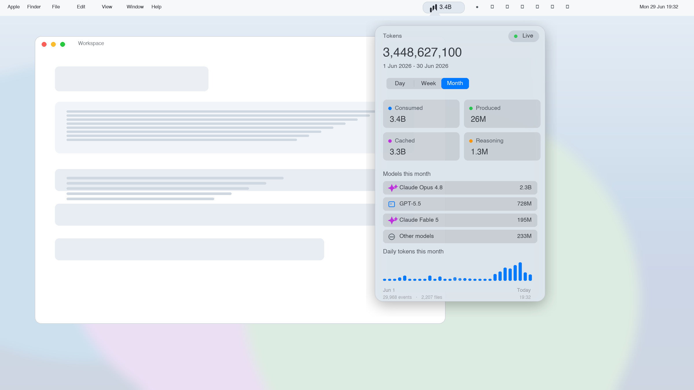
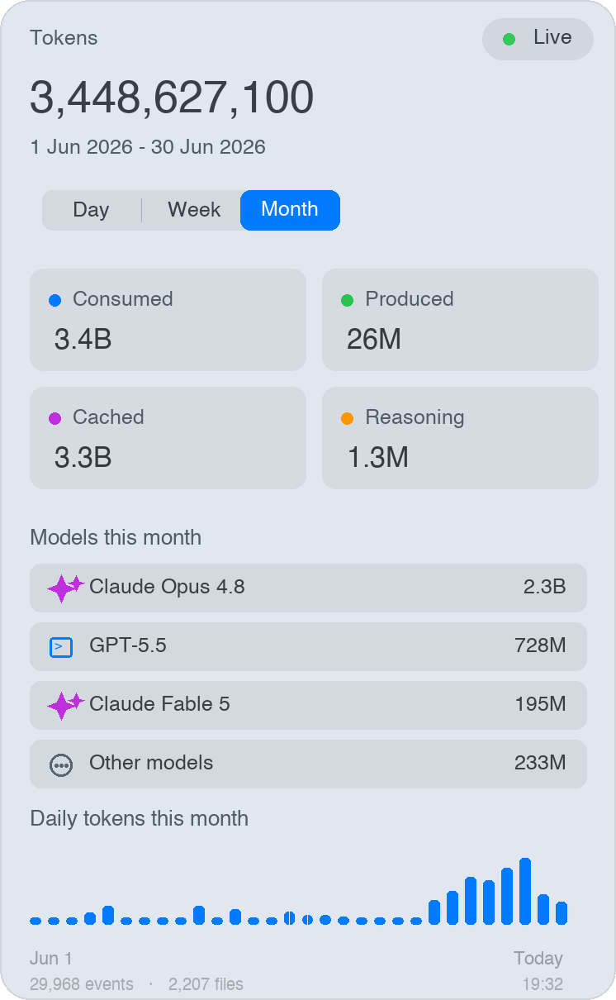

# TokenBar

Native macOS menu bar app for tracking local AI token usage across Codex and Claude.

It reads your local JSONL logs, counts consumed and produced tokens live, and shows day, week, and month views with model-level breakdowns.





## Install

```bash
npx tokenbar install
```

Or install directly from GitHub:

```bash
npx github:SantiPandal/tokenbar install
```

Requirements:

- macOS 14 or newer
- Swift toolchain via Xcode Command Line Tools
- Node.js 18 or newer for the `npx` installer

If Swift is missing:

```bash
xcode-select --install
```

## What It Shows

- Menu bar total for today
- Day, week, and month filters
- Consumed input tokens
- Produced output tokens
- Cached input tokens
- Reasoning output tokens when available
- Model breakdown for the selected period
- Hourly chart for today
- Daily chart for week and month

## Privacy

TokenBar is local-first. It does not send token logs anywhere.

It reads:

- `~/.codex/sessions`
- `~/.codex/archived_sessions`
- `~/.claude/projects`

The npm installer builds the native Swift app on your Mac, copies it to `~/Applications/TokenBar.app`, and optionally registers a user LaunchAgent so it opens at login.

## Commands

```bash
npx tokenbar install        # build, install, launch, and start at login
npx tokenbar install no-login
npx tokenbar status
npx tokenbar stop
npx tokenbar start
npx tokenbar restart
npx tokenbar doctor
npx tokenbar uninstall
```

## Develop

```bash
git clone https://github.com/SantiPandal/tokenbar.git
cd tokenbar
scripts/build_app.sh
open build/TokenBar.app
```

Print a token snapshot without opening the UI:

```bash
swift run -c release TokenBar --print-snapshot
```

Check the npm package contents before publishing:

```bash
npm pack --dry-run
```

## Publish

```bash
npm publish --access public
```

## License

MIT
